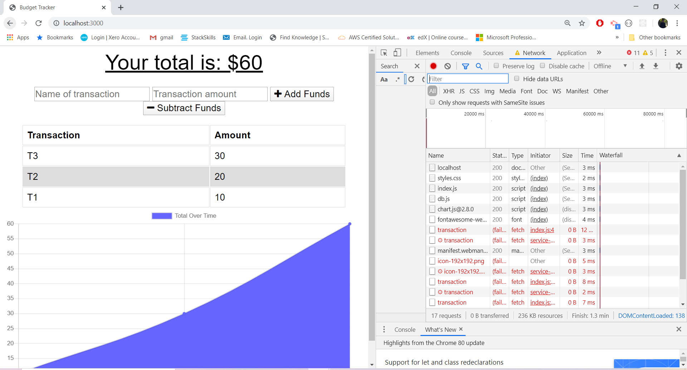
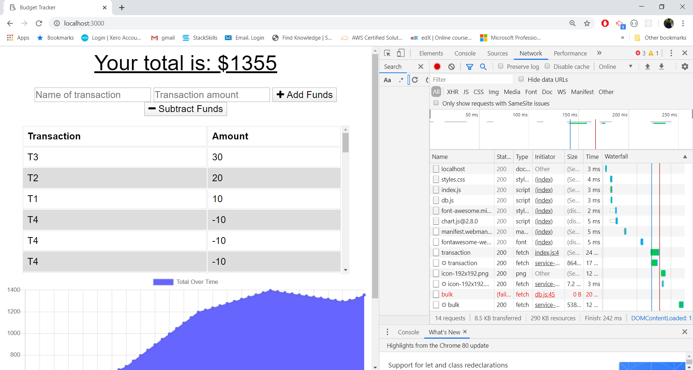

# Online-Offline-BudgetTrackers.io

# Description
The user must be able to add expenses and deposits to their budget with or without a connection. When entering transactions offline, they should populate the total when brought back online.

Offline Functionality:

  * Enter deposits offline

  * Enter expenses offline

When brought back online:

  * Offline entries should be added to tracker.
  
  ## User Story
AS AN avid traveller
Users want to be able to track their withdrawals and deposits with or without a data/internet connection
So that their account balance is accurate when they are traveling.

## Offline Application Functionality

## Online Application Functionality

## Deployed Application URL: https://enigmatic-reaches-32312.herokuapp.com/
